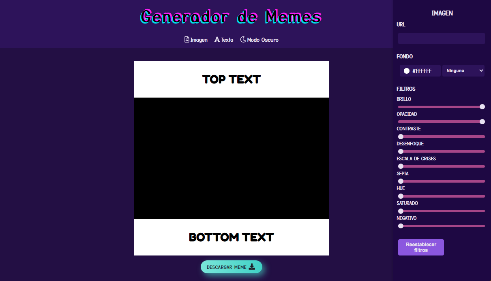
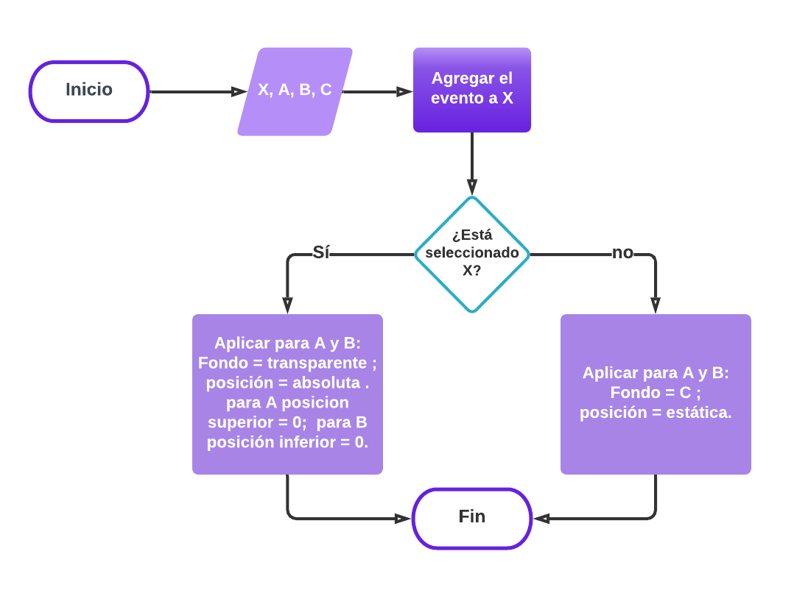

# Editor de Memes

Aplicación para editar texto e imagen de un meme, la cual se puede descargar para compartirla en las redes sociales.
Proyecto realizado como evaluación final del segundo modulo del curso desarrollo FrontEnd, utilizando **JavaScript** para modificar dinámicamente el contenido y las propiedades de la imagen y el texto.

<br>

## 👀 Haciendo click [aquí](https://maricaroj.github.io/editor-memes/) puedes verlo andar y editar tu propio meme 👩🏻‍💻

<br>




***Este proyecto no necesita la instalación de ninguna dependencia.*** 📌
<br><br>

# ⚙ Pseudocódigo de la sección Fondo Transparente del Texto
¿Cómo hacer para que el fondo del texto superior e inferior se transparente cuando seleccionamos el checkbox de **fondo transparente** y al deseleccionarlo sea del color elegido?

### Variables
```
X = checkbox
A = caja superior de texto
B = caja inferior de texto
C = selector de color de fuente
```

### Pseudocódigo
- *Inicio*
   - Leer variables: X, A, B, C
   - hacer: agregar el evento a X (determinar cual evento utilizaremos)
        - Si (X esta seleccionado) entonces
            - hacer: aplicar tanto a A como a B estilo de color de fondo = transparente; aplicar estilo de posicion = absoluta y aplicar estilo de posicion superio = 0 para A y estilo de posicion inferior = 0 para B.
        - SiNo 
            - hacer: aplicar tanto a A como a B estilo de color de fondo = C, y aplicar estilo de posicion = estatica.
        - Fin-Si<br>
- *Fin*

### DFD



---
Hecho con mucho amor por [Mí](https://github.com/maricaroj)💛💙❤️
